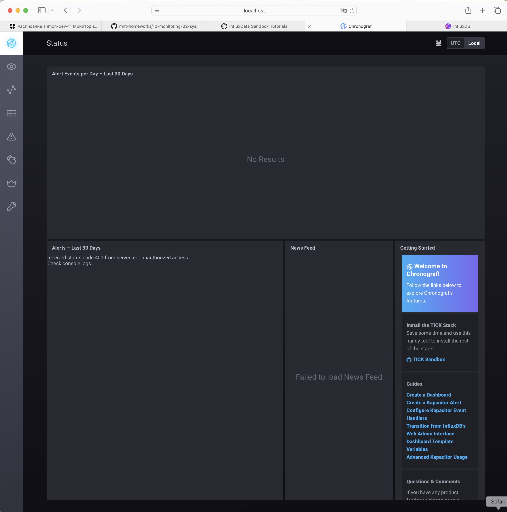
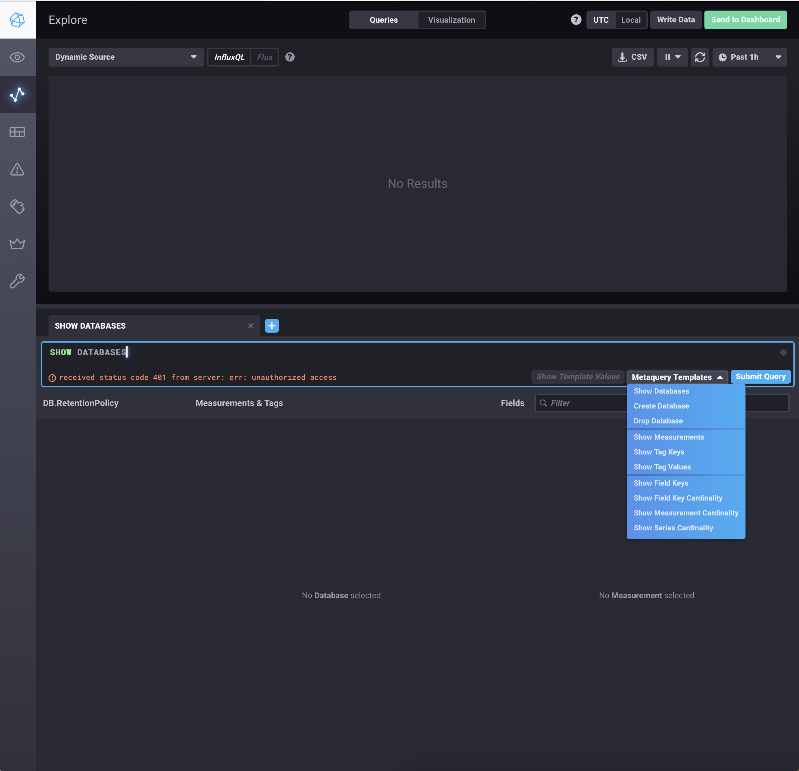
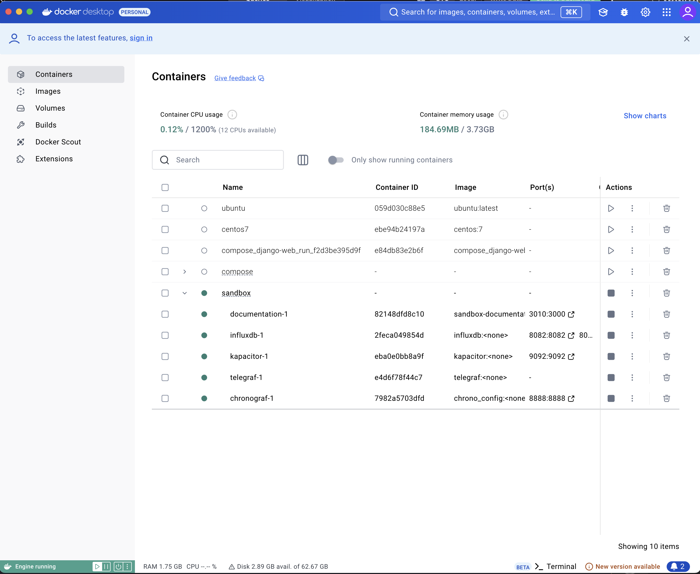
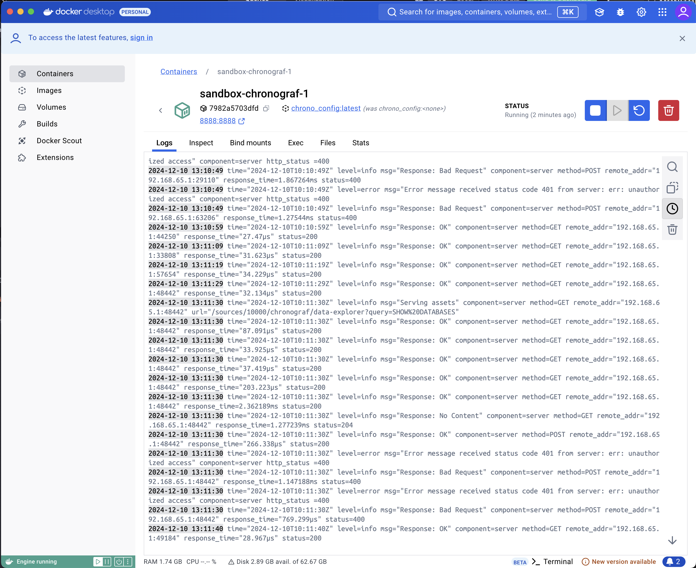
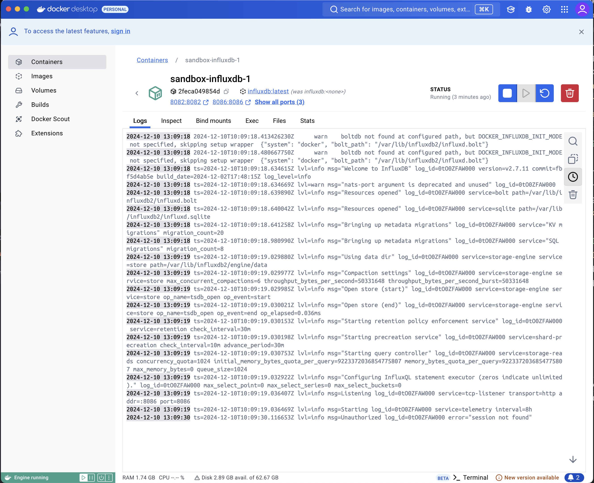

# Домашнее задание к занятию "13.Системы мониторинга"

## Обязательные задания

1. Вас пригласили настроить мониторинг на проект. На онбординге вам рассказали, что проект представляет из себя 
платформу для вычислений с выдачей текстовых отчетов, которые сохраняются на диск. Взаимодействие с платформой 
осуществляется по протоколу http. Также вам отметили, что вычисления загружают ЦПУ. Какой минимальный набор метрик вы
выведите в мониторинг и почему?

### ОТВЕТ:

1.1 Нагрузка на процессор (ЦПУ):
- Средняя загрузка ЦПУ (%): Позволяет контролировать, насколько загружены серверы вычислениями, и вовремя выявлять ситуации перегрузки.
- Среднее время простоя (Idle CPU): Важный индикатор наличия резервов для обработки новых задач.
- Процент использования каждого ядра: Если сервер многопроцессорный, важно оценивать распределение нагрузки между ядрами.
  
Вычисления загружают ЦПУ. Если ЦПУ перегружено, это может привести к снижению производительности, задержкам в обработке запросов и сбоям.

1.2 Оперативная память:
- Использование ОЗУ: Следует контролировать объем доступной памяти, чтобы предотвратить её исчерпание.
- Количество своппинга (Swap usage): Частое использование свопа может указывать на нехватку памяти.

Ограничения по памяти могут вызывать замедление вычислений и потенциальные сбои.

1.3 HTTP-сервис:
- Время отклика HTTP (Response Time): Оценка производительности платформы с точки зрения конечного пользователя.
- Коды ответов HTTP: Мониторинг кодов 2xx, 4xx, 5xx для оценки доступности сервиса.
- Количество входящих запросов (Request Rate): Позволяет выявить всплески активности и их корреляцию с производительностью.

Платформа взаимодействует с пользователями через HTTP. Мониторинг доступности и времени отклика позволяет оперативно выявлять проблемы на уровне сервиса.

1.4 Состояние файловой системы:
- Свободное место на диске: Контроль за объемом доступного пространства, так как отчеты сохраняются на диск.
- Скорость записи/чтения диска (Disk I/O): Высокая нагрузка на диск может замедлить генерацию отчетов.

Если пространство на диске закончится, система не сможет сохранять отчеты, что приведет к сбоям в работе платформы.

1.5 Состояние очередей (если используются):
- Длина очереди задач: Если вычисления выполняются асинхронно, нужно отслеживать, не растет ли очередь необработанных задач.

Большая очередь задач может указывать на проблемы с производительностью или нехваткой ресурсов.

1.6 Сетевые параметры:
- Использование сети (входящий/исходящий трафик): Для контроля за загрузкой сети.
- Потери пакетов и задержки: Важны для диагностики проблем на уровне коммуникации.

HTTP взаимодействие требует стабильной сети. Проблемы с сетью могут привести к снижению доступности сервиса.
#
2. Менеджер продукта посмотрев на ваши метрики сказал, что ему непонятно что такое RAM/inodes/CPUla. Также он сказал, 
что хочет понимать, насколько мы выполняем свои обязанности перед клиентами и какое качество обслуживания. Что вы 
можете ему предложить?

### ОТВЕТ:

2.1 Бизнес-ориентированные метрики
- Доступность сервиса (Service Availability)
Процент времени, когда платформа была доступна для клиентов.
Формула:
Доступность = Время работы без сбоев / Общее время × 100%
Пример: "Сервис был доступен 99.9% времени за месяц."
- Время отклика сервиса (Response Time)
Среднее время ответа сервера на HTTP-запросы.
Пример: "Среднее время ответа — 250 мс, 95-й перцентиль — 400 мс."
Используйте перцентили для оценки качества обслуживания в большинстве случаев, исключая редкие пики.
- Успешность выполнения запросов (Success Rate)
Процент успешных запросов (HTTP 2xx) от общего числа.
Пример: "99.8% запросов завершились успешно за последний день."

2.2 Метрики, связанные с клиентскими задачами
- Время обработки вычислений (Task Processing Time)
Среднее время выполнения вычислительной задачи от получения до выдачи отчета.
Пример: "Среднее время выполнения задачи — 10 минут."
- Уровень отказов (Task Failure Rate)
Процент задач, завершившихся с ошибкой.
Пример: "1.5% задач завершились ошибкой за последний месяц."
- Время до доставки отчета (Report Delivery Time)
Полный цикл от момента запроса до сохранения отчета на диск.
Пример: "Среднее время доставки отчета — 15 минут."

2.3 Индикаторы клиентского опыта
- Удовлетворенность пользователей (User Satisfaction Metrics)
Если есть клиентские опросы или отзывы: интеграция с Net Promoter Score (NPS) или Customer Satisfaction Score (CSAT).
Пример: "NPS за квартал: 80/100."
- Жалобы и обращения
Количество обращений пользователей в поддержку (если данные доступны).
Пример: "5 жалоб на задержки выполнения задач за месяц."

2.4 Прогнозируемые и опережающие метрики
- Уровень использования ресурсов (Resource Utilization)
Преобразовать сложные метрики в простые индикаторы:
"Система работает в штатном режиме (использование ЦПУ: 70%)."
"Риски перегрузки через 2 дня (свободное место на диске: 10%)."
- Риски SLA
Выделить потенциальные проблемы, которые могут нарушить выполнение SLA.
Пример: "Вероятность превышения времени обработки задач: 15%."

2.5 Визуализация
- Постройте дашборды в понятной для менеджера форме (например, в Grafana, Kibana или других BI-инструментах).
- Используйте графики и простые KPI:
- Индикаторы доступности (зеленый/желтый/красный).
- Графики времени выполнения задач.
- Число успешных и неуспешных запросов.

2.6 Как донести сложные термины
- RAM: "Оставшаяся оперативная память (доступно X ГБ)."
- CPUla (Load Average): "Нагрузка на процессоры сервера (сейчас используется Y% от общего ресурса)."
- Inodes: "Свободное пространство для сохранения файлов (доступно X файлов)."
#

3. Вашей DevOps команде в этом году не выделили финансирование на построение системы сбора логов. Разработчики в свою 
очередь хотят видеть все ошибки, которые выдают их приложения. Какое решение вы можете предпринять в этой ситуации, 
чтобы разработчики получали ошибки приложения?

### ОТВЕТ:

3.1 Локальное сохранение логов
- Настройте приложения так, чтобы они записывали ошибки в локальные файлы (например, /var/logs/app-errors.log).
- Используйте ротацию логов через logrotate, чтобы избежать переполнения диска:
- Укажите ограничение на размер логов.
- Настройте автоматическое удаление старых логов.

3.2 Отправка ошибок через Email
- Настройте приложение так, чтобы критические ошибки отправлялись на общий почтовый ящик разработчиков:
- Используйте инструменты, такие как Postfix или SMTP-клиенты в самом приложении.
- Убедитесь, что уведомления отправляются только для важных событий, чтобы избежать спама.

3.3 Интеграция с мессенджерами
Используйте API мессенджеров для отправки уведомлений об ошибках:
- Реализуйте в приложении простую отправку сообщений с ошибками.
- Настройте вебхуки для интеграции с мессенджерами.
Преимущество: Разработчики получают уведомления в реальном времени.

3.4 Системный сбор логов через syslog
- Настройте отправку ошибок в системный журнал (syslog).
- Используйте инструмент rsyslog или journald для централизованного сбора логов на одном сервере.
- Разработчики могут подключаться к этому серверу для просмотра логов.

3.5 Использование облачных сервисов с бесплатными тарифами
Если разрешено использование облачных решений:
- Настройте отправку логов в сервисы с бесплатными планами (например, Loggly, Papertrail, Elastic Cloud).
- Ограничьте объем отправляемых логов, чтобы укладываться в бесплатный лимит.

3.6 Локальный стек ELK
- Разверните упрощенную версию стека ELK (Elasticsearch, Logstash, Kibana) на одном сервере.
- Это требует минимальных затрат, если ресурсы серверов уже доступны.
- Для упрощения можно использовать только Logstash и Elasticsearch, если визуализация не критична.

3.7 Логирование в базу данных
- Направляйте ошибки в реляционную базу данных (например, PostgreSQL или MySQL).
- Создайте простую веб-интерфейс для просмотра логов, например, с помощью PHP/JavaScript.

3.8 Использование стандартных инструментов ОС
- Разработчики могут подключаться к серверам через SSH и использовать grep, tail, cat для анализа локальных логов.
- Настройте доступ только к нужным логам с ограничениями прав.

3.9 Документирование
- Обязательно создайте документ или инструкцию, описывающую, где искать логи и как их анализировать.
- Добавьте скрипты для автоматизации поиска ошибок (например, поиск по ключевым словам).

3.10 Ограничение объема логов
- Убедитесь, что приложения используют логгирование уровней (ERROR, WARN, INFO), чтобы отправлять разработчикам только действительно важные ошибки.
- Реализуйте фильтрацию сообщений на уровне приложений или системных логгеров.
#

4. Вы, как опытный SRE, сделали мониторинг, куда вывели отображения выполнения SLA=99% по http кодам ответов. 
Вычисляете этот параметр по следующей формуле: summ_2xx_requests/summ_all_requests. Данный параметр не поднимается выше 
70%, но при этом в вашей системе нет кодов ответа 5xx и 4xx. Где у вас ошибка?

### ОТВЕТ:

Ошибка в расчете SLA возникает из-за того, что формула 
SLA = summ_2xx_requests / summ_all_requests

предполагает, что все HTTP-коды, кроме 2xx, должны относиться к ошибкам. Однако, в HTTP есть коды, которые не являются ошибками, но при этом не относятся к успешным (2xx).
К таким кодам относятся:
Информационные коды (1xx):
Например, 100 (Continue) или 101 (Switching Protocols).
Они используются в некоторых протоколах и могут появляться в метриках.
Коды перенаправления (3xx):
Например, 301 (Moved Permanently) или 302 (Found).
Эти коды не считаются ошибками, но не являются успешными запросами (2xx).
Причина проблемы:
Если в вашей системе есть значительная доля запросов с кодами 1xx или 3xx, они включаются в summ_all_requests, но не учитываются в 
summ_2xx_requests. Это приводит к тому, что вычисляемый SLA оказывается ниже ожидаемого.

Как исправить:
- Уточните определение SLA. Если SLA подразумевает "все запросы, не завершившиеся ошибкой (4xx/5xx)", формулу нужно изменить:
SLA = summ_2xx_requests + summ_3xx_requests + summ_1xx_requests / summ_all_requests
- Исключите коды 1xx и 3xx из учета, если они не относятся к SLA. Если SLA оценивает только успешные запросы (2xx), проверьте, не возникают ли избыточные перенаправления (3xx) или некорректная обработка.
- Проверьте источники трафика. Коды 3xx часто генерируются при неправильной настройке редиректов. 
Например:
Зацикленные или лишние перенаправления могут сигнализировать о проблемах конфигурации.


#
5. Опишите основные плюсы и минусы pull и push систем мониторинга.

### ОТВЕТ:

- Pull системы
Плюсы: централизованный контроль, простая диагностика, безопасность.
Минусы: сложности с доступом в сети, нагрузка на мониторинг, требует стандартного API.
Подходит для: статических систем с предсказуемой инфраструктурой.

- Push системы
Плюсы: не зависит от сетевого доступа, удобна для динамических систем, гибкость отправки данных.
Минусы: сложная диагностика, риск потерь данных, требует защиты канала передачи.
Подходит для: динамических и распределенных систем.


#
6. Какие из ниже перечисленных систем относятся к push модели, а какие к pull? А может есть гибридные?

    - Prometheus 
    - TICK
    - Zabbix
    - VictoriaMetrics
    - Nagios
  
### ОТВЕТ:

Pull: Prometheus, VictoriaMetrics, Nagios.
Push: TICK.
Hybrid: Zabbix.

#
7. Склонируйте себе [репозиторий](https://github.com/influxdata/sandbox/tree/master) и запустите TICK-стэк, 
используя технологии docker и docker-compose.

В виде решения на это упражнение приведите скриншот веб-интерфейса ПО chronograf (`http://localhost:8888`). 

P.S.: если при запуске некоторые контейнеры будут падать с ошибкой - проставьте им режим `Z`, например
`./data:/var/lib:Z`
### ОТВЕТ:



#
8. Перейдите в веб-интерфейс Chronograf (http://localhost:8888) и откройте вкладку Data explorer.
        
    - Нажмите на кнопку Add a query
    - Изучите вывод интерфейса и выберите БД telegraf.autogen
    - В `measurments` выберите cpu->host->telegraf-getting-started, а в `fields` выберите usage_system. Внизу появится график утилизации cpu.
    - Вверху вы можете увидеть запрос, аналогичный SQL-синтаксису. Поэкспериментируйте с запросом, попробуйте изменить группировку и интервал наблюдений.

Для выполнения задания приведите скриншот с отображением метрик утилизации cpu из веб-интерфейса.
### ОТВЕТ:






#
9. Изучите список [telegraf inputs](https://github.com/influxdata/telegraf/tree/master/plugins/inputs). 
Добавьте в конфигурацию telegraf следующий плагин - [docker](https://github.com/influxdata/telegraf/tree/master/plugins/inputs/docker):
```
[[inputs.docker]]
  endpoint = "unix:///var/run/docker.sock"
```

Дополнительно вам может потребоваться донастройка контейнера telegraf в `docker-compose.yml` дополнительного volume и 
режима privileged:
```
  telegraf:
    image: telegraf:1.4.0
    privileged: true
    volumes:
      - ./etc/telegraf.conf:/etc/telegraf/telegraf.conf:Z
      - /var/run/docker.sock:/var/run/docker.sock:Z
    links:
      - influxdb
    ports:
      - "8092:8092/udp"
      - "8094:8094"
      - "8125:8125/udp"
```

После настройке перезапустите telegraf, обновите веб интерфейс и приведите скриншотом список `measurments` в 
веб-интерфейсе базы telegraf.autogen . Там должны появиться метрики, связанные с docker.

Факультативно можете изучить какие метрики собирает telegraf после выполнения данного задания.

### ОТВЕТ:


#

## Дополнительное задание (со звездочкой*) - необязательно к выполнению

1. Вы устроились на работу в стартап. На данный момент у вас нет возможности развернуть полноценную систему 
мониторинга, и вы решили самостоятельно написать простой python3-скрипт для сбора основных метрик сервера. Вы, как 
опытный системный-администратор, знаете, что системная информация сервера лежит в директории `/proc`. 
Также, вы знаете, что в системе Linux есть  планировщик задач cron, который может запускать задачи по расписанию.

Суммировав все, вы спроектировали приложение, которое:
- является python3 скриптом
- собирает метрики из папки `/proc`
- складывает метрики в файл 'YY-MM-DD-awesome-monitoring.log' в директорию /var/log 
(YY - год, MM - месяц, DD - день)
- каждый сбор метрик складывается в виде json-строки, в виде:
  + timestamp (временная метка, int, unixtimestamp)
  + metric_1 (метрика 1)
  + metric_2 (метрика 2)
  
     ...
     
  + metric_N (метрика N)
  
- сбор метрик происходит каждую 1 минуту по cron-расписанию

Для успешного выполнения задания нужно привести:

а) работающий код python3-скрипта,

б) конфигурацию cron-расписания,

в) пример верно сформированного 'YY-MM-DD-awesome-monitoring.log', имеющий не менее 5 записей,

P.S.: количество собираемых метрик должно быть не менее 4-х.
P.P.S.: по желанию можно себя не ограничивать только сбором метрик из `/proc`.

2. В веб-интерфейсе откройте вкладку `Dashboards`. Попробуйте создать свой dashboard с отображением:

    - утилизации ЦПУ
    - количества использованного RAM
    - утилизации пространства на дисках
    - количество поднятых контейнеров
    - аптайм
    - ...
    - фантазируйте)
    
    ---

### Как оформить ДЗ?

Выполненное домашнее задание пришлите ссылкой на .md-файл в вашем репозитории.

---